# Multistep Workflow Test

## Pre-requisites
- Download Test Dataset at https://github.com/USNISTGOV/MIST/wiki/testdata/Small_Fluorescent_Test_Dataset.zip
- A running instance of the WIPP system ([installation instructions](../deployment/wipp-complete-single-node/README.md))
- Being familiar with the notions of images collections, plugins and workflows ([user guide](../user-guide/README.md))
- The following plugins are registered in the WIPP system being tested ([how to register a plugin](../user-guide/plugins/README.md)):
 - MIST - Microscopy Image Stitching Tool ([link to plugin manifest](https://github.com/usnistgov/MIST/blob/master/wipp-plugin.json))
 - Pyramid Building ([link to plugin manifest](https://github.com/usnistgov/WIPP-pyramid-plugin/blob/master/wipp-pyramid-plugin.json))
 - Image Assembling ([link to plugin manifest](https://github.com/usnistgov/WIPP-image-assembling-plugin/blob/master/wipp-image-assembling-plugin.json))
 - EGT Segmentation ([link to plugin manifest](https://github.com/usnistgov/WIPP-EGT-plugin/blob/master/wipp-egt-plugin.json))
 - Feature Extraction ([link to plugin manifest](https://github.com/usnistgov/WIPP/blob/master/plugins/wipp-feature2djava-plugin.json))
 
## Upload images collection

Go to "Data" -> "Images collections".  

  

Click on "New images collection", fill in the Name field as "small-fluorescent-dataset" and click on "Save".  

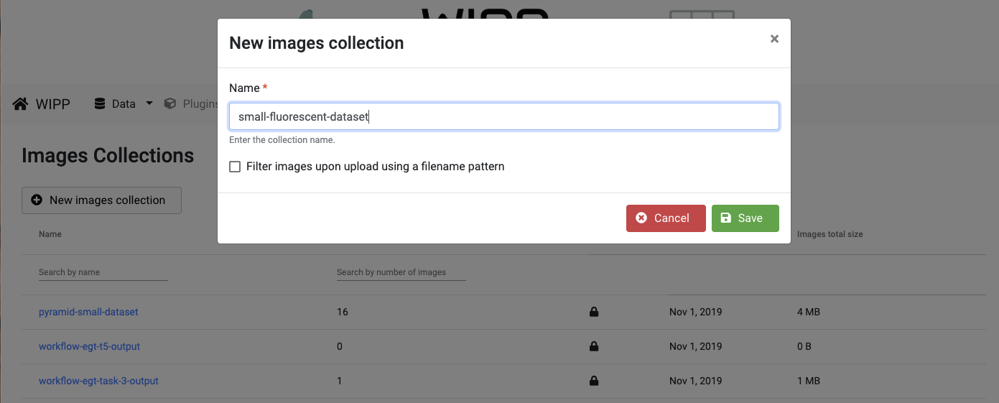  

Upload the images located in the folder "inputCollection", wait for all images to be converted and lock the collection by clicking on the lock icon on the right.  

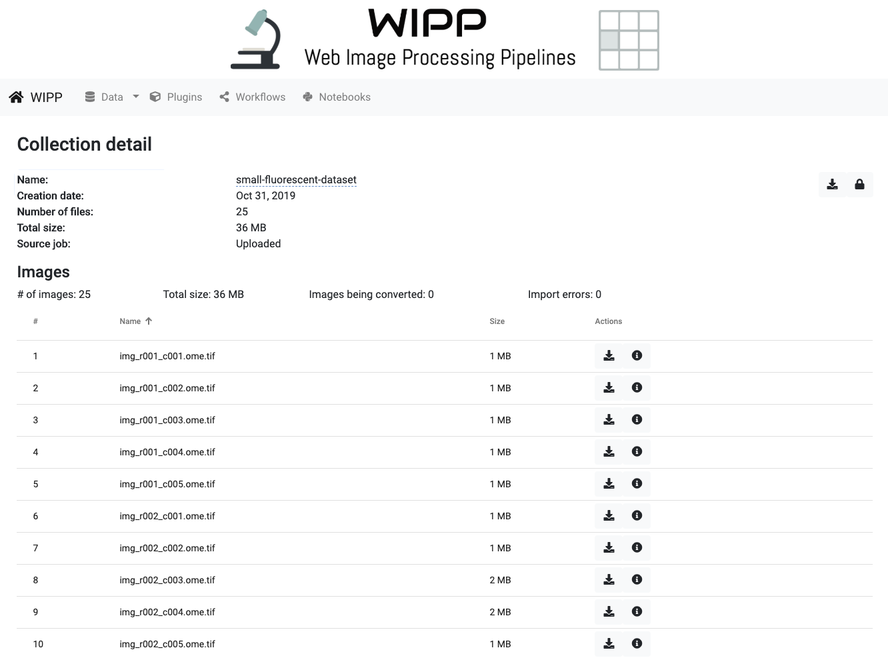

Input images (5x5 grid of Cy5 images):

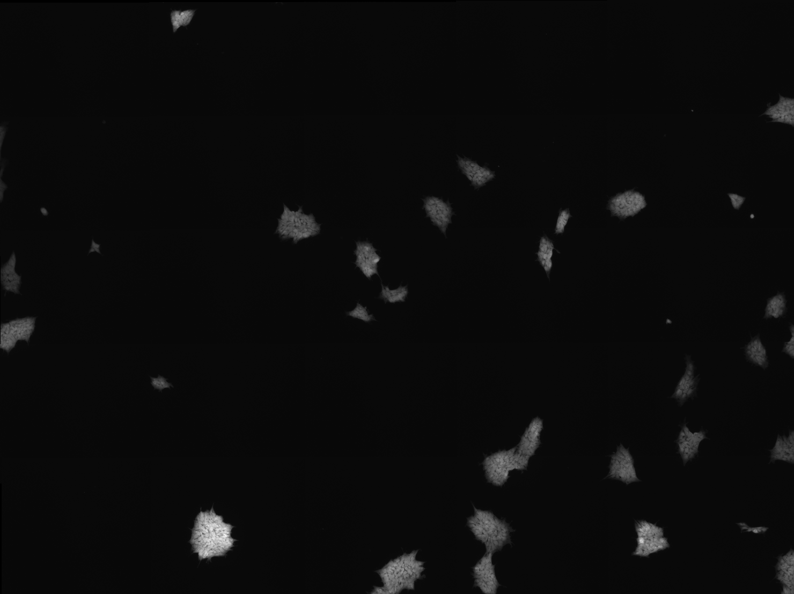

 
## Create the workflow

Go to "Workflows".  

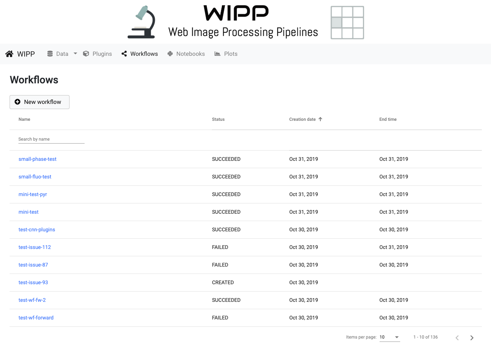

Click on "New workflow", fill in the Name field as "small-fluoro-test" and click on "Save".  

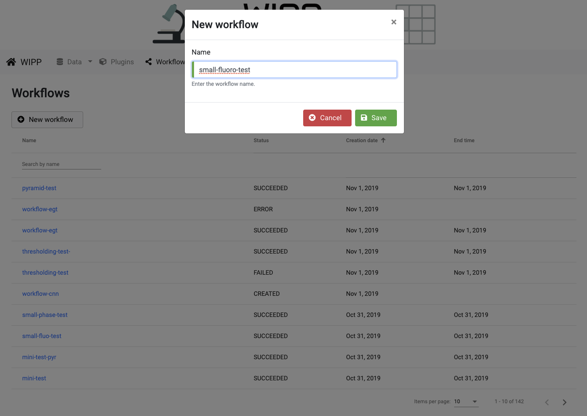

### Image Stitching task

Click on "Add task" and choose "MIST 2.0.7" in the dropdown list.  

Configure the task as follow:
- Task name: stitch
- Assemble No Overlap: False
- Input Images: start typing "small-fluorescent-dataset" and select this collection from the list
- Filename Pattern Type: ROWCOL
- Filename Pattern: img_r{rrr}_c{ccc}.ome.tif
- Starting Point: UL
- Grid Width: 5
- Grid Height: 5
- Start Tile Row: 1
- Start Tile Column: 1
- Has timeslices: uncheck box
- Leave all other Advanced parameters blank or default

Click on "Add task"

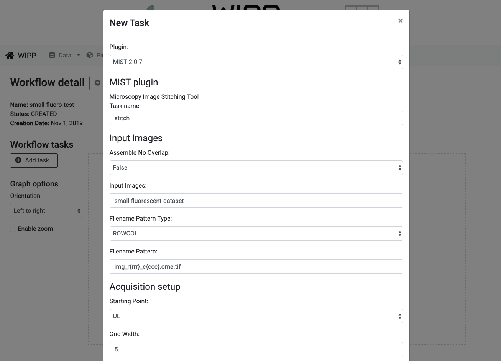

### Image Assembling task

Click on "Add task" and choose "WIPP Image Assembling Plugin 0.0.2" in the dropdown list.  

Configure the task as follow:
- Task name: assemb
- Input Images: start typing "small-fluorescent-dataset" and select this collection from the list
- Input Stitching Vector: start typing "{{ small-fluoro-test-stitch.outputPath }}" and select this stitching vector (from previous step) from the list

Click on "Add task"

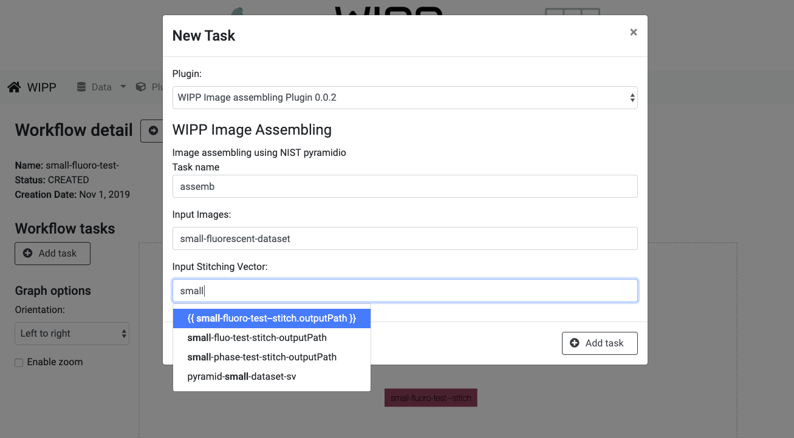

### Pyramid Building task

Click on "Add task" and choose "WIPP Pyramid plugin 0.0.2" in the dropdown list.  

Configure the task as follow:
- Task name: pyr
- Input Images: start typing "small-fluorescent-dataset" and select this collection from the list
- Input Stitching Vector: start typing "{{ small-fluoro-test-stitch.outputPath }}" and select this stitching vector (from previous step) from the list
- Blending method: overlay
- Image depth: 16U

Click on "Add task"

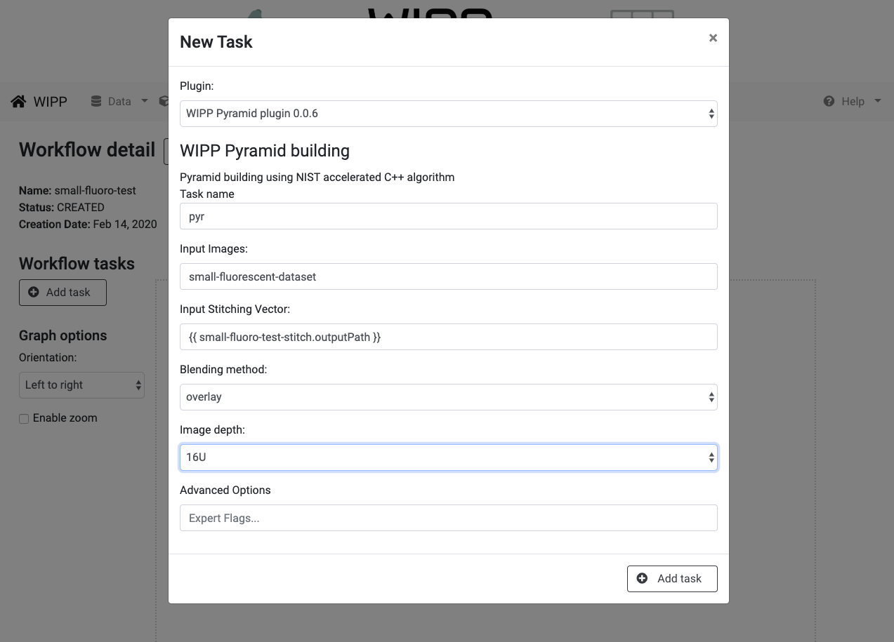

### EGT Segmentation task

Click on "Add task" and choose "EGTSegmentationPlugin 1.0.3" in the dropdown list.  

Configure the task as follow:
- Task name: seg
- Input Images: start typing "{{ small-fluoro-test-assemb.output }}" and select this collection from the list
- Minimum Hole Size: 2000
- Minimum Object Size: 1000
- Image Depth: 16U
- Generate Labeled Masks instead of Binary Masks: check box (the labeled masks will be used in the next task)

Click on "Add task"

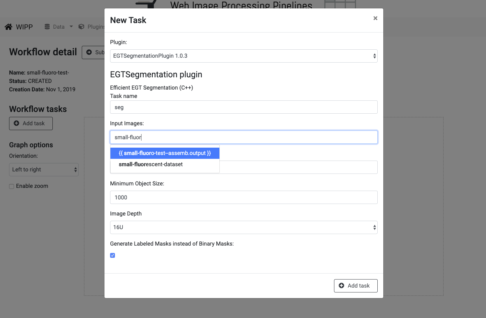

### Feature Extraction task

Click on "Add task" and choose "WIPP Feature2DJava Plugin 1.4.0" in the dropdown list.  

Configure the task as follow:
- Task name: feat
- Input Images: start typing "{{ small-fluoro-test-assemb.output }}" and select this collection from the list
- Input names pattern: .*.ome.tif
- Input Partitions (masks): start typing "{{ small-fluoro-test-seg.output }}" and select this collection from the list
- Mask names pattern: .*.ome.tif
- Features: select a few features from the list by clicking "Add" to add a new feature (for example, Area, Mean, Standard Deviation and Skewness)

Click on "Add task"

### Submit Workflow

Click on "submit workflow" to submit the workflow.

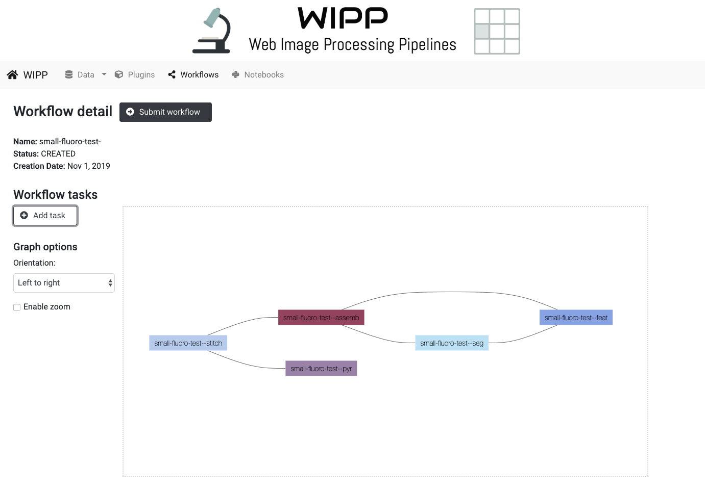

Click on "Monitor in Argo" the monitor the workflow execution.

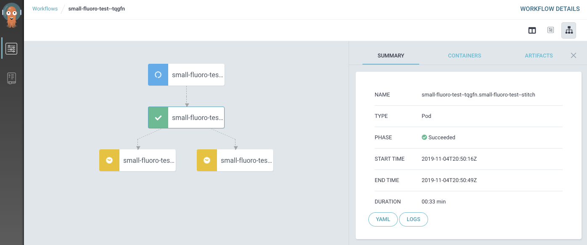

## Results

### Pyramid view of assembled image

Go to "Data" -> "Pyramids"

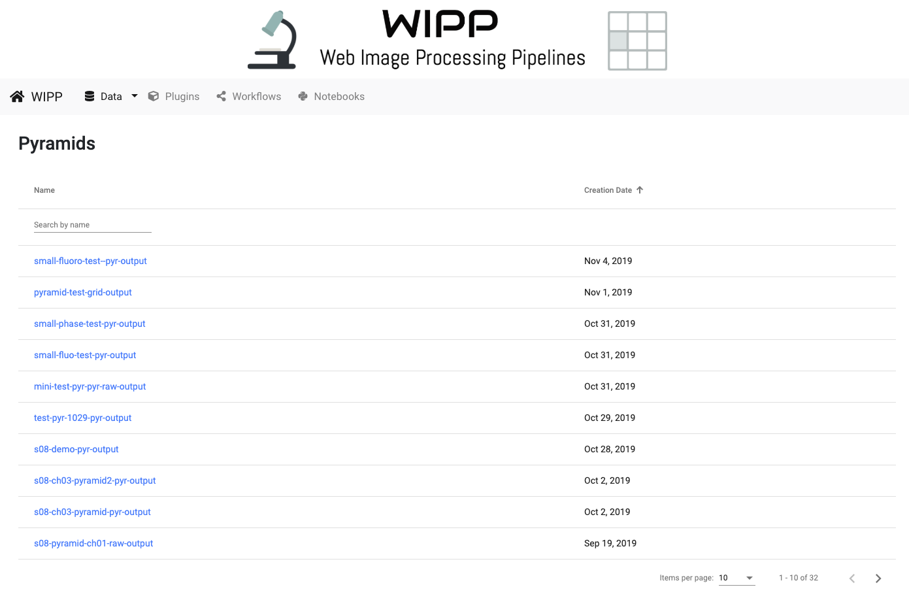

The pyramid will appear in the list as "small-fluo-test-pyr-output".  

On the left side of the of pyramid, scroll down to the "Filtering" section and click on "Modify filters".  
Select "+ Exposure" on the left and adjust exposure using the slider.

Output pyramid:

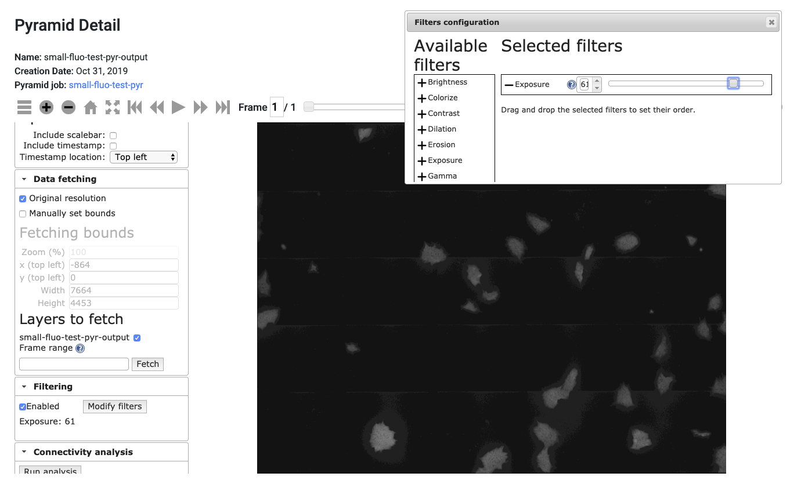

### Image features from assembled image

Go to "Data" -> "Csv Collections"

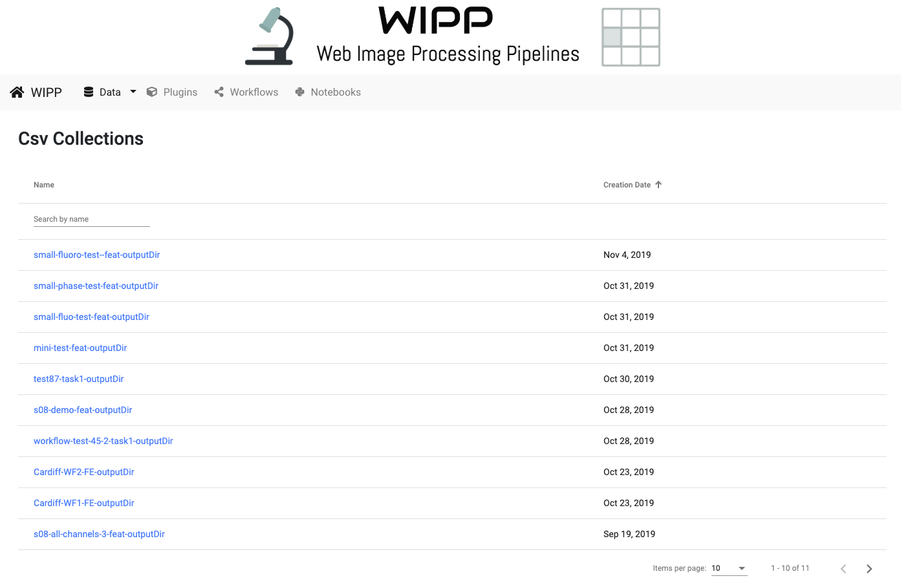

The CSV collection will appear in the list as "small-fluo-test-feat-outputDir".

Output CSV collection:

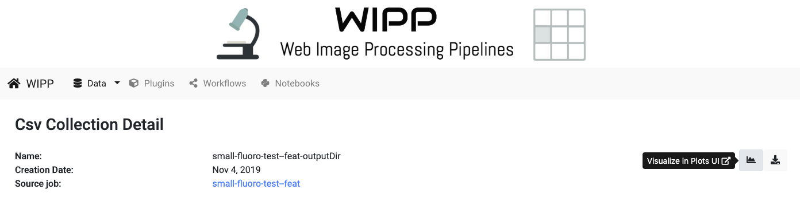

Click on the Plots icon on the right to go to the Plots view, then click on "Load File" and select one of the plots on the right.

