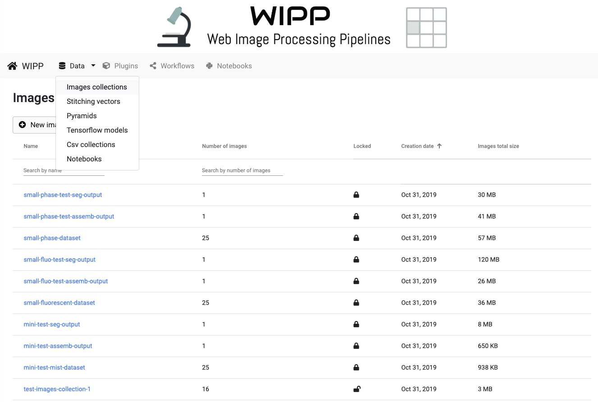
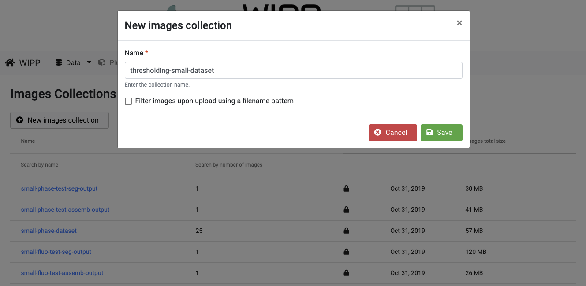
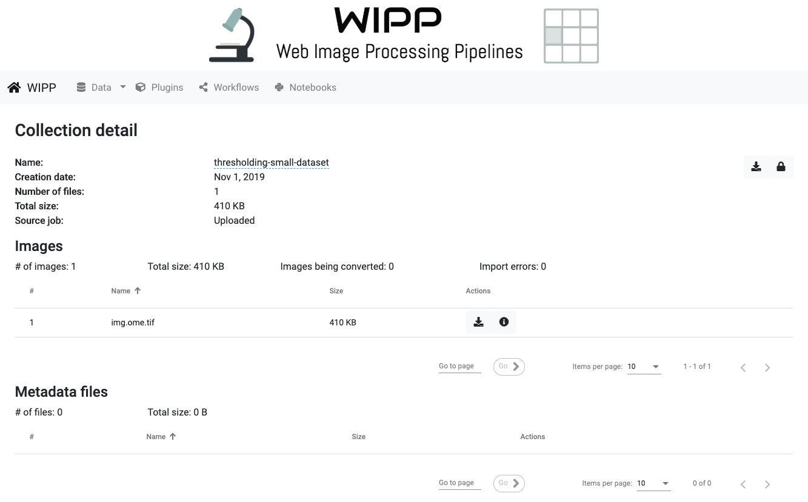
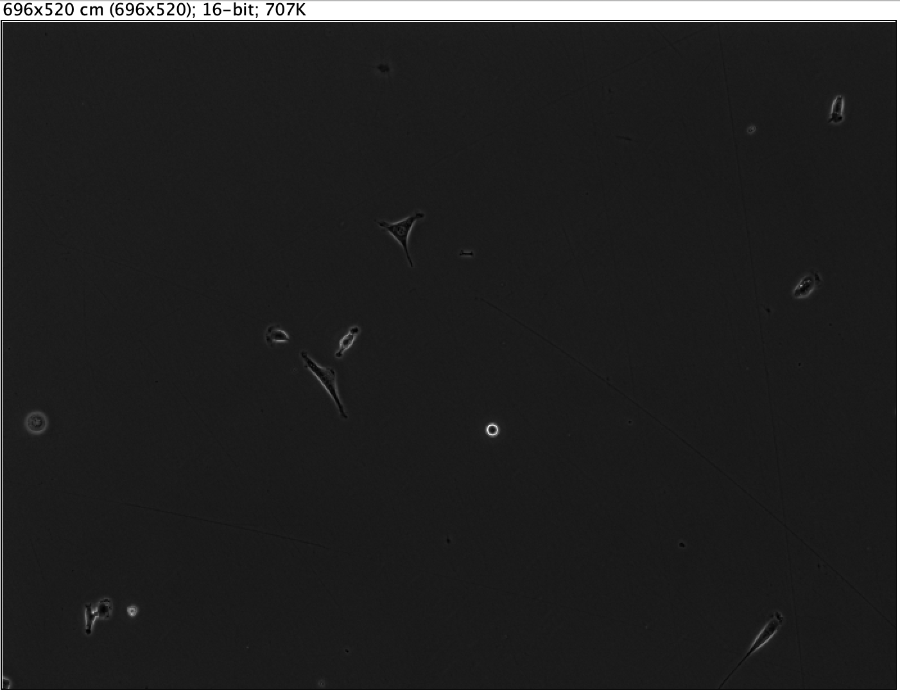
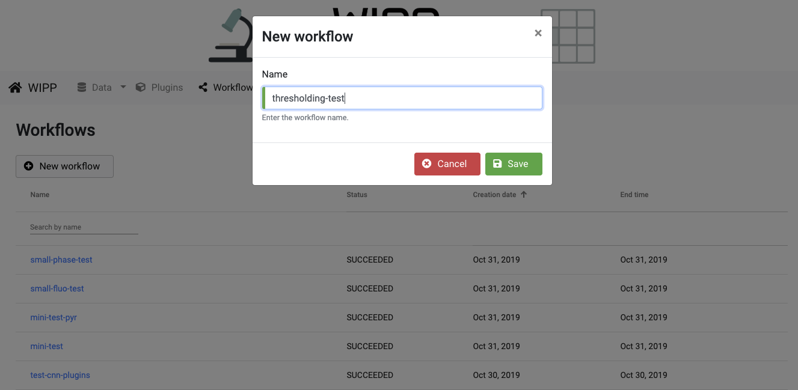
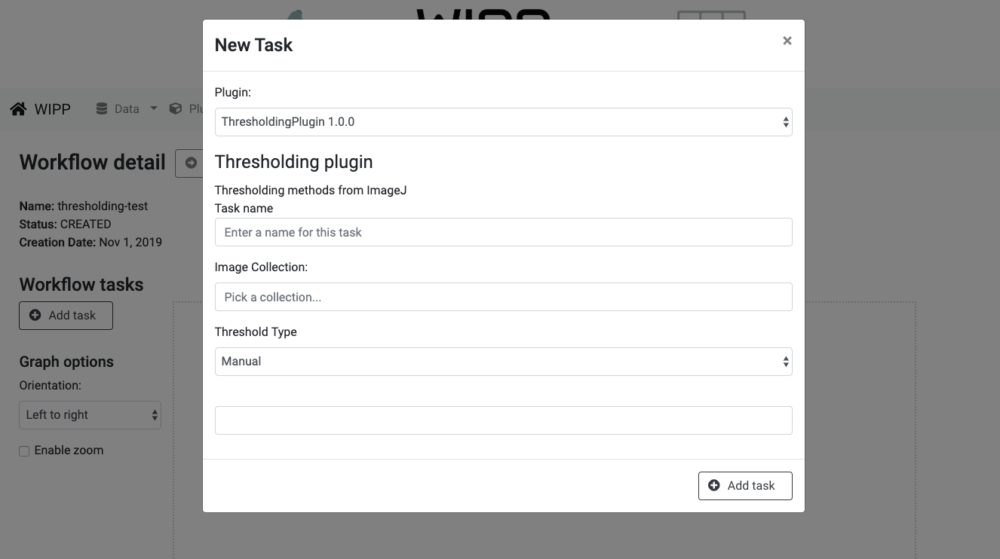
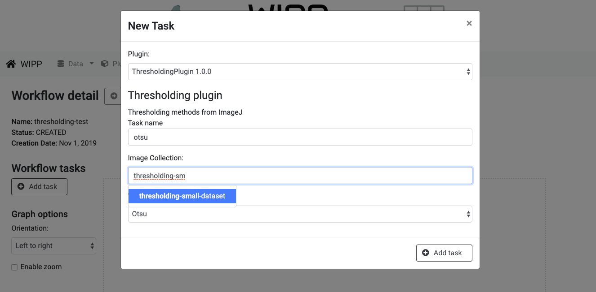
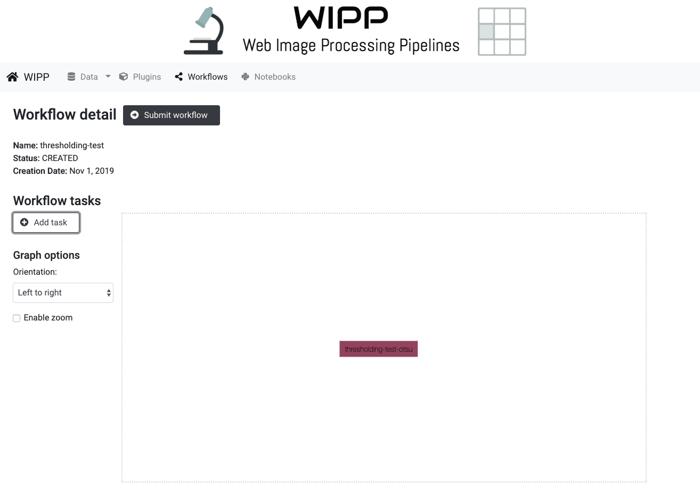
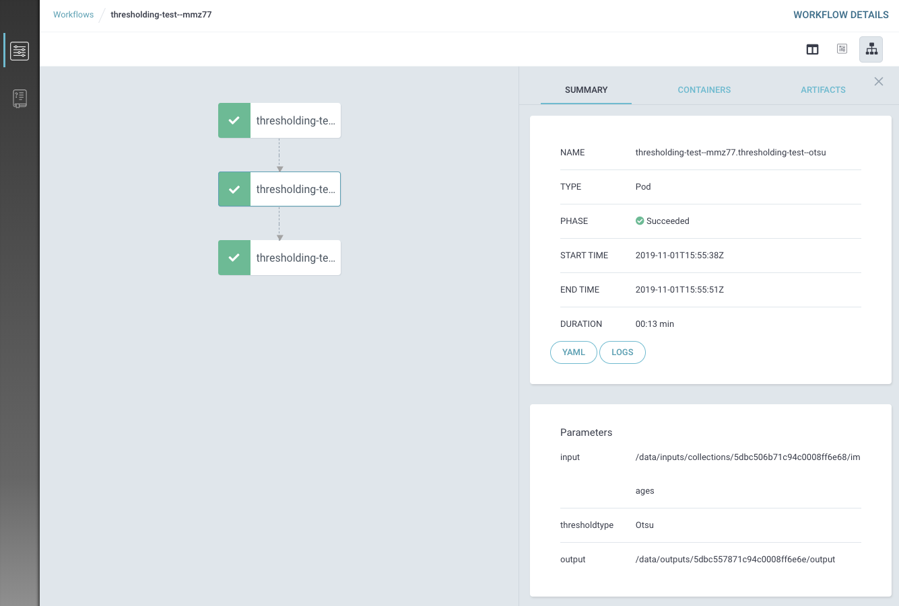
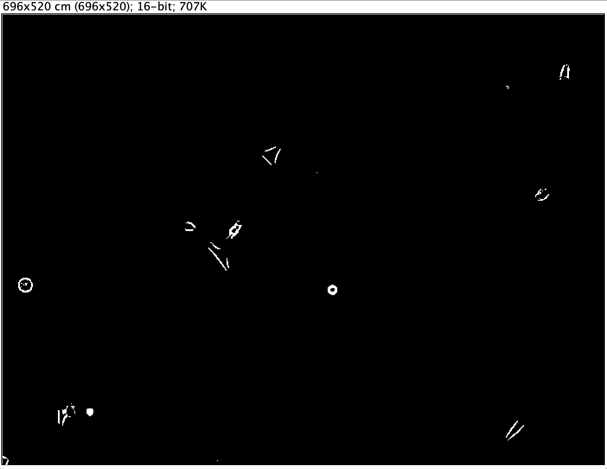

# Thresholding test

## Pre-requisites

- A running instance of the WIPP system ([installation instructions](../deployment/wipp-complete-single-node/README.md))
- Being familiar with the notions of images collections, plugins and workflows ([user guide](../user-guide/README.md))
- The following plugin is registered in the WIPP system being tested ([how to register a plugin](../user-guide/plugins/README.md)):
 - Thresholding ([link to plugin manifest](https://github.com/usnistgov/WIPP-thresholding-plugin/blob/master/plugin.json))
 
## Upload images collection

Go to "Data" -> "Images collections".  

  

Click on "New images collection", fill in the Name field as "thresholding-small-dataset" and click on "Save".  

  

Upload the image located in the folder "inputCollection", and lock the collection by clicking on the lock icon on the right.  

Uploaded image:

 
## Create the workflow

Go to "Workflows".  

Click on "New workflow", fill in the Name field as "thresholding-test" and click on "Save".  

Click on "Add task" and choose "ThresholdingPlugin 1.0.0" in the dropdown list.  

Configure the task as follow:
- Task name: ostu
- Image Collection: start typing "thresholding-small-dataset" and select this collection in the list
- Threshold Type: select "Otsu"
Click on "Add task"

Click on "submit workflow" to submit the workflow.

Click on "Monitor in Argo" the monitor the workflow execution.

The segmented image will appear in a new collection named "thresholding-test-otsu-output".

Output image:

