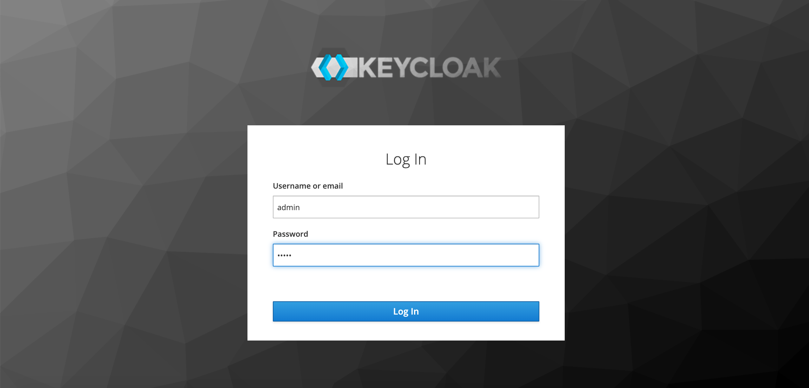
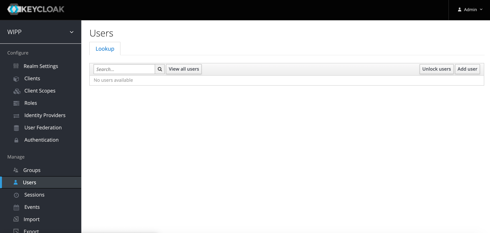
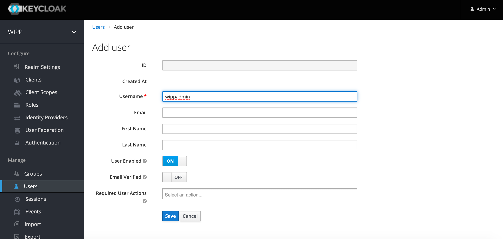
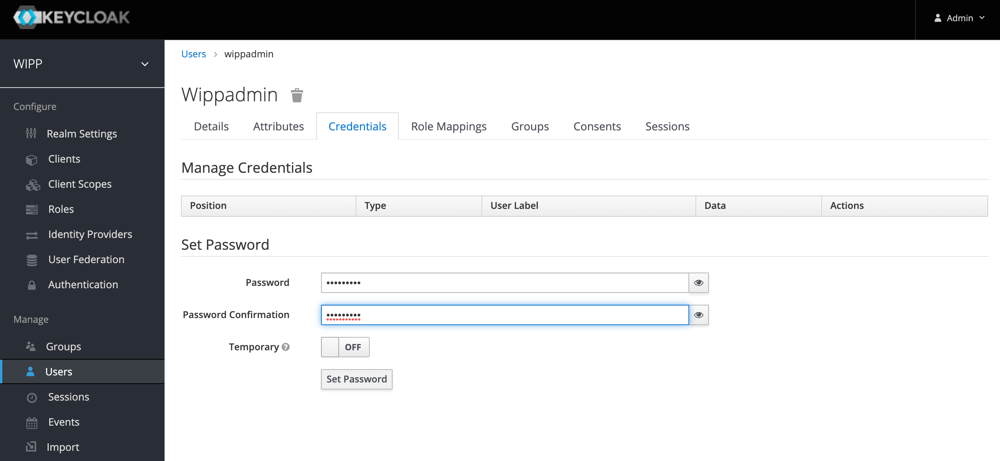
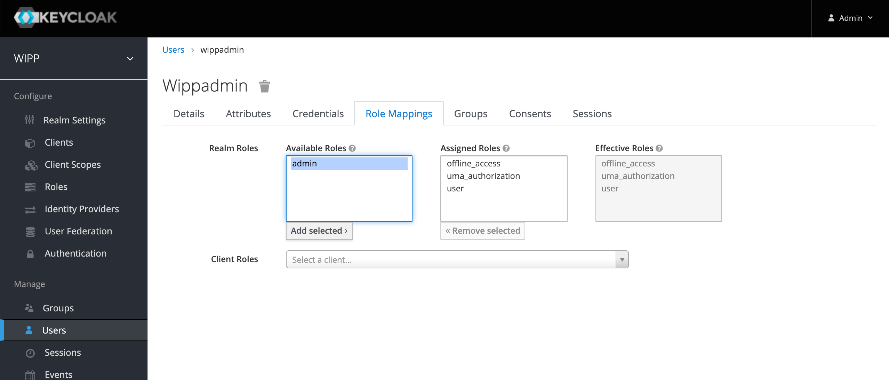
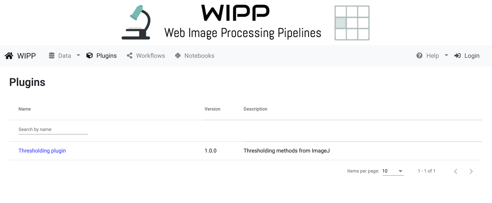
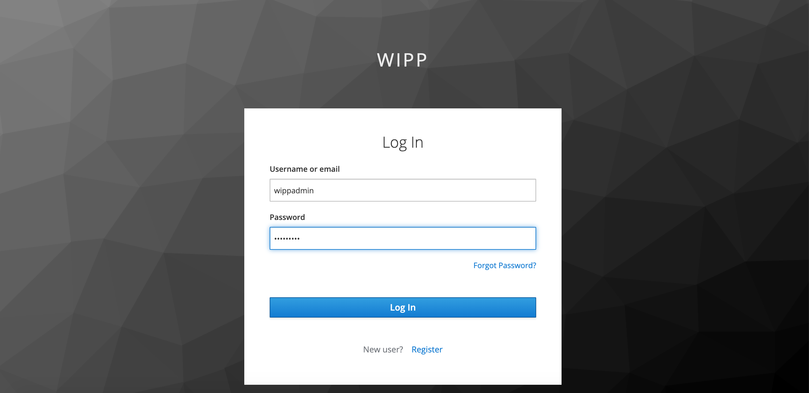

# WIPP Post-installation instructions

WIPP uses Keycloak as an identity manager, more information about Keycloak available at: https://www.keycloak.org/

Once WIPP has been installed, you need to create a WIPP administrator user in Keycloak in order to be able to register plugins.

1. Open the Keycloak administration console at `http://x.x.x.x:32006/auth` (`x.x.x.x` is the IP of your machine or the Multipass VM depending on your installation) and log in using the Keycloak admin user (admin/admin by default).

*Figure 1: WIPP Keycloak admin login*

2. Click on "Users" (left side bar) and "Add user" (right button).

*Figure 2: WIPP Keycloak users dashboard*

3. Fill-in the username (for example: "wippadmin") and click on "Save"

*Figure 3: WIPP Keycloak add user*

4. Open the "Credentials" tab and set a password (for example: "wippadmin"), unchek "Temporary" and click on "Set Password"

*Figure 4: WIPP Keycloak set user password*

5. Open the "Role Mappings" tab, select "admin" under "Availbale Roles" and click on "Add selected"

*Figure 5: WIPP Keycloak set user role*

6. You can now go back to the WIPP application and login (top-right button "Login") as "wippadmin"

*Figure 6: WIPP application login*

*Figure 7: WIPP Keycloak user login*

7. Additional users can be created by following steps 1 to 5 (no role mapping needed for non-admin users), or users can register themselves by clicking on the "Register" link below the "Log in" on the Keycloak login page

*Figure 8: WIPP Keycloak user login*