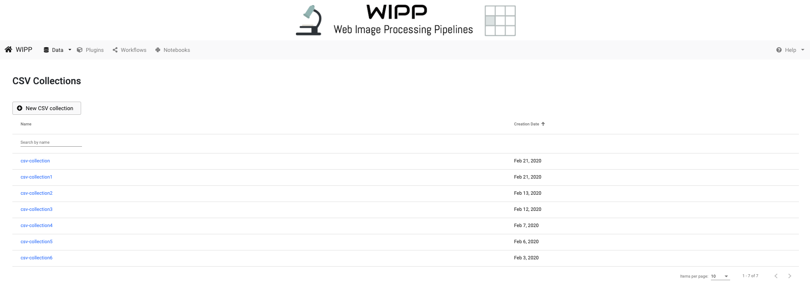
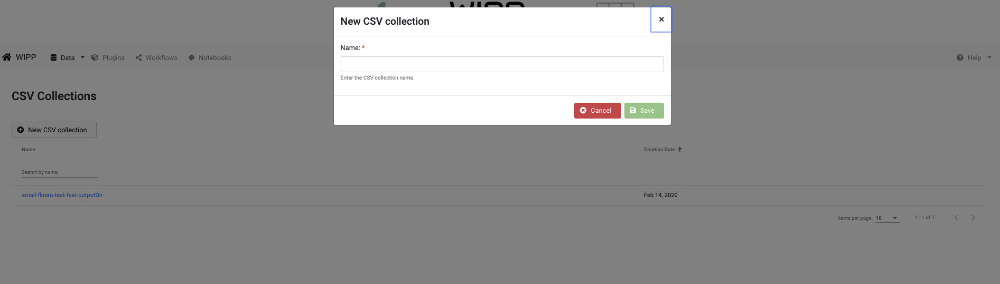
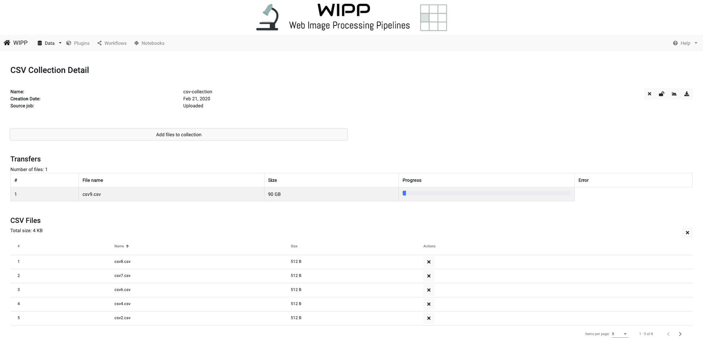

# CSV Collections

The CSV Collections view exposes the interface for a user to transfer data from disk to the WIPP system and manage the data. 
The data management includes creation of CSV collections, uploading, downloading and deleting CSV files. 
Click on "Data" on the menu bar, then "CSV collections" to access CSV collections management. 

*Figure1: WIPP CSV Collections screenshot*

This view displays the list of available CSV Collections, which can be sorted by name and creation date. 
The sorting is achieved by clicking on the arrows next to the column headings. 
The edit box below the heading "Name" is designed for entering text to filter the list of items shown below. 
Click on the name of a collection to access the collection details.

# Create a new CSV collection

From the CSV Collections view, click on the "New CSV collection" button to create a new collection and start uploading CSV files:

*Figure 2: WIPP Create CSV Collection screenshot*

Enter a name for the new CSV collection, then click on save to proceed to the CSV Collection detail view.

# Collection detail information

The information about collections includes name, creation date and the source source job if the collection has been created during the execution of a workflow. 
The collection name must be unique.

*Figure 3: WIPP CSV Collection detail screenshot*

# Upload csv

Upload CSV files using the "Add files to collection" button.
The progress of the upload is displayed using a progress bar per file.

*Figure 4: WIPP CSV Collection upload screenshot*

# Download CSV

The whole CSV collection can be downloaded as a ZIP file using the download button from the top right corner of the view.

# Delete CSV

Each CSV in a collection can be deleted using the delete button with the cross icon from the "Actions" column. 
The whole collection can be deleted using the delete button from the top right corner of the view.
Note: if the collection is locked, neither the collection nor individual CSV inside of it can be deleted.

# Lock CSV Collection
 
The collection can be locked using the "lock" button from the top right corner of the view.
Note: If a collection is locked, neither the entire collection nor individual CSV files in the collection can be deleted or modified.

# Visualize CSV plots in plots UI

You can visualize the CSVs of the current collection directly in the Plots UI by clicking  the "Visualize in Plots UI" button located in the top right corner of the page.

# Change CSV Collection visibility to Public

Once a CSV Collection is locked, its visibility can be changed to "Public" by clicking on the user group icon on the right. 
Public visibility means that the collection can be seen and downloaded by all connected and anonymous users, and can be used by other connected users in workflows. It cannot be modified or deleted by other users, except for admin users.
Once a collection is Public, its visibility can not be changed back to Private.
