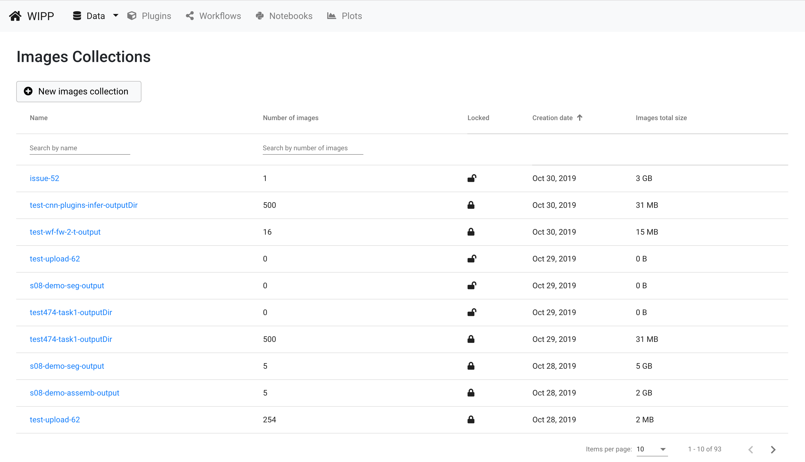
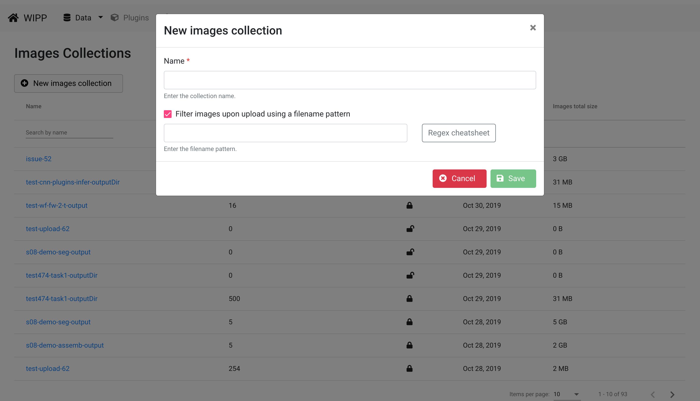
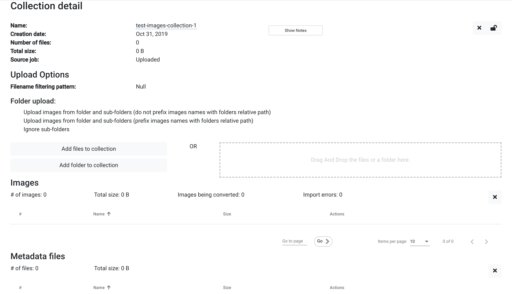
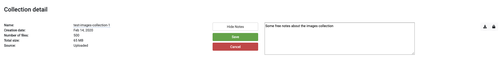
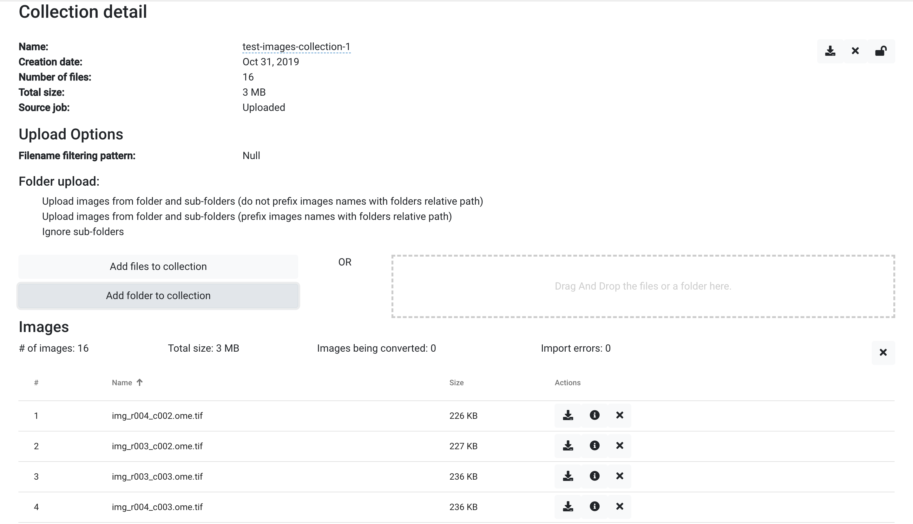

# Image Collections

A user starts with image collections saved on a disk and needs to upload files to WIPP. The Image Collections view exposes the interface for a user to transfer data from disk to the WIPP system and manage the data. The data management includes creation of image collections, uploading and downloading files, and file deletion before collections are processed. Click on "Data" on the menu bar, then "Images collections" to access images collections management. 

*Figure1: WIPP Image Collections screenshot*

This view displays the list of available Image Collections, which can be sorted by name, number of images, lock status, creation date and size. The sorting is achieved by clicking on the arrows next to the column headings. 
The edit boxes below the headings "Name"" and Number of Images" are designed for entering text to filter the list of items shown below. Click on the name of a collection to access the collection details.

# Preparing your data for WIPP

For the best experience using WIPP, please prepare your data using the following recommendations:
* Images should be 8 or 16 bpp (32 bpp is not yet supported across all WIPP algorithms)
* Image file names should not contain spaces or special characters such as: ()[]{}\/+="!@#$%^&*~`';:/? (should they be present in file names, they will be removed in case of spaces or replaced by underscores upon upload to the WIPP system)
* Numbering in file names: any numbers which need to be iterated over (such as row, column, index, etc.) should be zero padded. 
For example, tiles images for a grid of 10 rows x 10 columns may be named as follow: img-r01-c01.tif to img-r10-c10.tif

# Create a new image collection

From the Image Collections view, click on the "New images collection" button to create a new collection and start uploading images:

*Figure 2: WIPP Create Image Collection screenshot*

Enter a name of the new collection and configure the upload options, then click on save to proceed to the Image Collection detail view.

**Note**: When checking the box "Filter images upon using a filename pattern", a text field appears to specify the pattern. The pattern field allows to upload images whose names match the specified pattern (regular expression). If left blank, the pattern field do not affect the image upload and therefore all images are uploaded.

# Collection detail information

The information about collections includes name, creation date, number of files in the collection, total size of the collection, the source job if the collection has been created during the execution of a workflow, and the filename pattern. The collection name must be unique and may be modified any time by clicking on it and editing the text.

*Figure 3: WIPP Image Collection screenshot*

The collection also contains a "notes" field that allows the user to write personal notes about the experiment / the data.

*Figure 4: WIPP Image Collection notes screenshot*

# Upload images

Upload images using the "Add files to collection" or "Add folder to collection" buttons, or drag and drop files from your computer to the "Drag and Drop" area on the right. The option "Add folder to collection" might not be available in some web browsers. Uploaded files other than images will be classified as "Metadata files". Uploaded images will be automatically tiled, converted to the OME-TIFF format and compressed using a Lempel-Ziv-Welch (LZW) compression.
The progress of the upload is displayed using a progress bar per file. All files are displayed in two tables, one for image tiles and one for metadata files. The progress of image conversions to OME-TIFF format is also displayed on top of the Images table, as "Images being uploaded: #number". 
File upload can be slow since it depends on the connectivity between the server and the browser. File conversion to ome.tif may take longer than the upload depending on the computing power of the server.

**Note**: Upload options facilitates images upload when dealing with folders.
It is recommended to use Google Chrome to upload images to take advantage of the following folder upload options:
- Upload images from folder and sub-folders: all images found recursively in the uploaded folder and matching the pattern (if any) will be added to the collection
- Ignore sub-folders: only images found in the uploaded folder and matching the pattern (if any) will be added to the collection, images in sub-folders will be ignored
- Inclupe path in images names: all images found recursively in the uploaded folder and matching the pattern (if any) will be added to the collection, and their path in the hierarchy of the uploaded folder will be added as the prefix to the image name (i.e., image1 contained in FolderA -> FolderB -> image1 will become FolderA_FolderB_image1 when uploading FolderA)
See illustrated examples in the Help section of WIPP.

*Figure 5: WIPP Image Collection upload screenshot*

# Download images

Each image in a collection can be downloaded using the download button with the arrow icon from the "Actions" column. 
The whole image collection can be downloaded as a ZIP file using the download button from the top right corner of the view.

# Download metadata

Each image might be associated with the metadata information describing the microscope acquisition parameters. The metadata information per image can be downloaded using the download button with the icon containing "i" from the "Actions" column. 

# Delete images

Each image in a collection can be deleted using the delete button with the cross icon from the "Actions" column. The whole collection can be deleted using the delete button from the top right corner of the view.
Note: if the collection is locked, neither the collection nor individual images inside of it can be deleted.

# Lock Image Collection

Before any image collection is processed by a WIPP job, it must be locked to guarantee traceability of any results back to the source collection. The collection can be locked using the "lock" button from the top right corner of the view.
Note: If a collection is locked, neither the entire collection nor individual images in the collection can be deleted or modified. However, the image collection name can still be modified, and the change will be reflected in any job using the image collection.