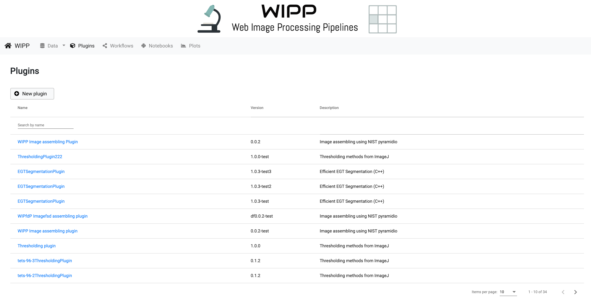
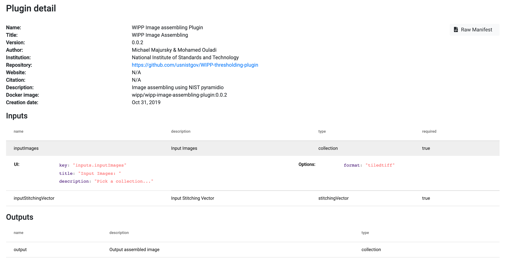
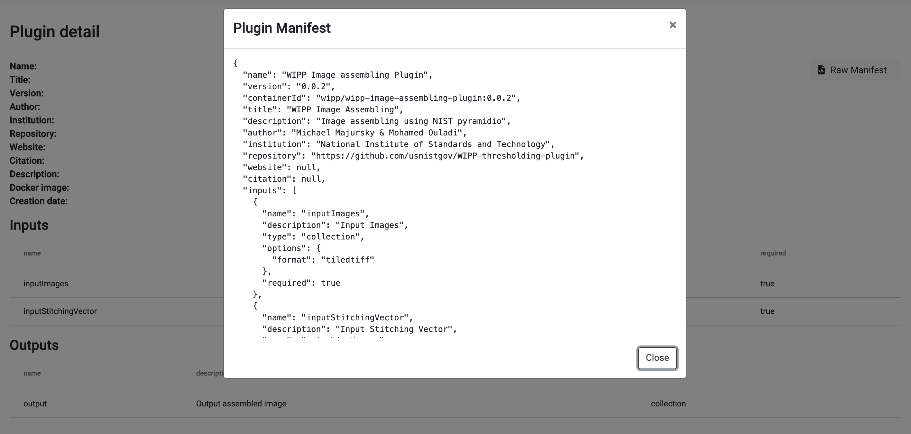

# Plugins

The "Plugins" tab of the navigation bar exposes the list of plugins currently available in WIPP.
You can browse the different pages and change the number of plugins displayed per page. 
We provide filters to sort plugins by name and to search a plugin by it's name.

From this page you can:
* click on "new plugin" to create a [new plugin](#new-plugin)
* click on a plugin and see its [details](#plugin-details)

*Figure 1: plugins main page*

# New Plugin

The "New plugin" button opens a pop up that allows the user to create a new plugin (JSON format). 
We handle three different ways of creating a new plugin: 

* browse file from local directory (only plain txt and json files are accepted)
* get file by url (for example the raw json file in github)
* copy and paste text 
    
No matter the chose option, it is possible to preview and edit the text manually in the text box.

*Figure 2: creation of a new plugin*

If the JSON descriptor of the plugin is ready, click "Register plugin" to register it. 
If there is an issue with the manifest, an error message explaining the issue will be displayed.
Otherwise, a success message will appear and you will be redirected to the details page of your new plugin.

*Figure 3: example of error in the JSON format*

# Plugin Details

Clicking on a plugin in the main page exposes the details of the chosen plugin. 
Numerous information are available like the name and version, the author and institution...
The inputs and outputs of a plugin are displayed. It is possible to click each input to have more details about it.

*Figure 4: example of plugin details*

The "Raw Manifest" button on the upper right displays the original JSON of the manifest (The one that was written in the ["new plugin"](#new-plugin) case).

*Figure 5: example of plugin raw manifest*
