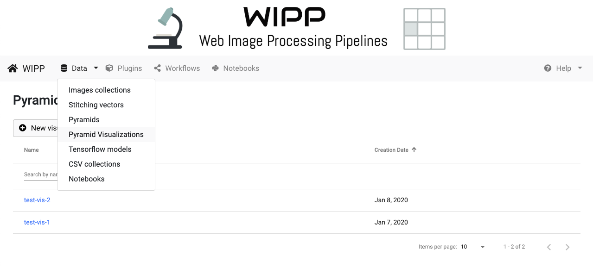
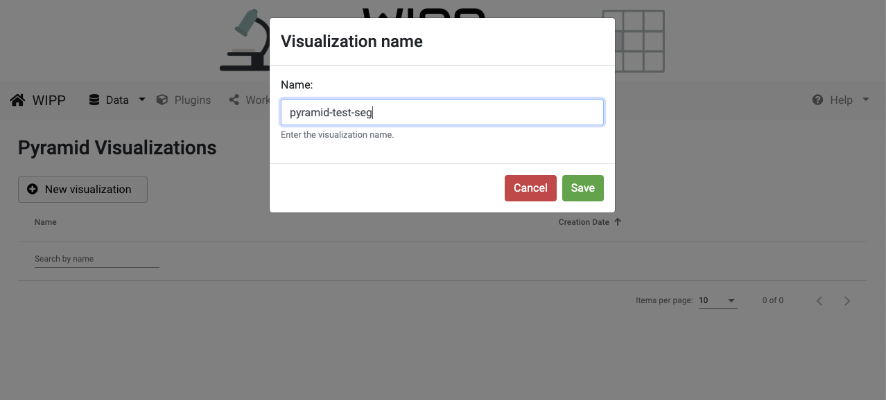
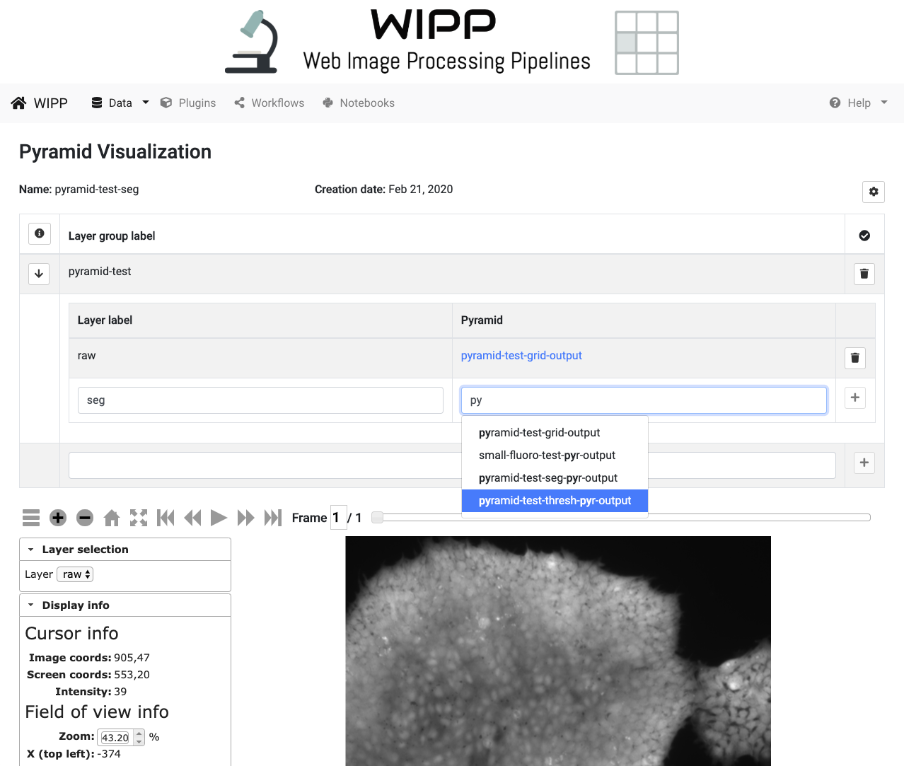
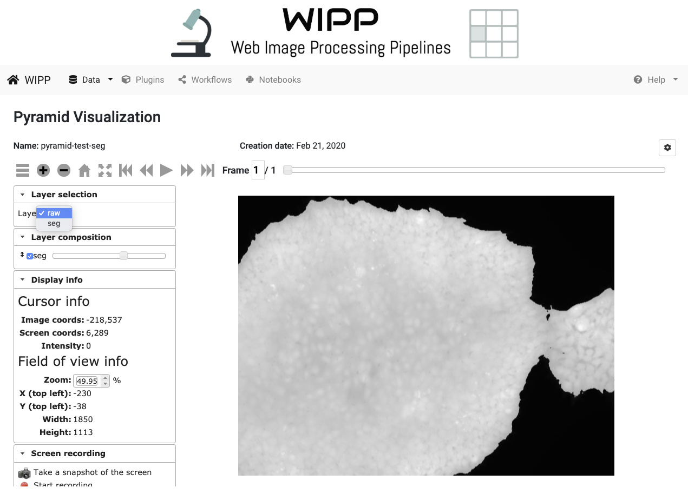

# Pyramid Visualizations

Multiple pyramids can be combined into a single visualization with multiple layers. This step must be executed once all pyramids have been built.

Click on "Data" on the menu bar, then "Pyramid Visualizations" to access the list of Pyramid Visualization. 

*Figure1: WIPP Pyramids list screenshot*

This view displays the list of available Pyramids, which can be sorted by name and creation date. The sorting is achieved by clicking on the arrows next to the column headings. 
The edit box below the heading "Name"" is designed for entering text to filter the list of items shown below. Click on the name of a pyramid visualization to access the pyramid visualization configuration and deep zoom view.

From this page you can:
* click on "New visualization" to create a [new visualization](#new-visualization)
* click on an existing visualization and see its [details and deep zoom view](#pyramid-visualization-detail-view)

# New Visualization

The "New visualization" button opens a pop up that allows the user to create a new pyramid visualization.

Choose a name and hit the "Save" button.

  
*Figure 2: Creation of a new pyramid visualization*

# Pyramid visualization detail view

The information about the pyramid visualization includes name, creation date and visualization configuration. Below the pyramid information is the deep zoom view of the pyramid visualization.

*Figure 3: WIPP Pyramid visualization configuration screenshot*

The different layers of the pyramid visualization can be configured in the configuration panel (click on the cog icon on the right side to show/hide the configuration panel).
- Groups: Create one or more groups to group pyramids. Give the group a label and click "+"
- Layers: Add layers (pyramids) to the group with "+" (for example, add Raw and Segmentation pyramids to check the accuracy of a segmentation)

*Figure 4: WIPP Pyramid visualization deep zoom view screenshot*

For an in-depth user manual of the deep zoom view of pyramids, see [this webpage](https://isg.nist.gov/deepzoomweb/help#image-view-web-deep-zoom-toolkit) (please note that some of deep zoom tools are not available in WIPP, such as colony searching and features).

# Change Pyramid visualization visibility to Public

A visualization visibility can be changed to "Public" by clicking on the user group icon on the right. 
Public visibility means that the visualization can be seen all connected and anonymous users. It cannot be modified or deleted by other users, except for admin users.
Once a visualization is Public, its visibility can not be changed back to Private.