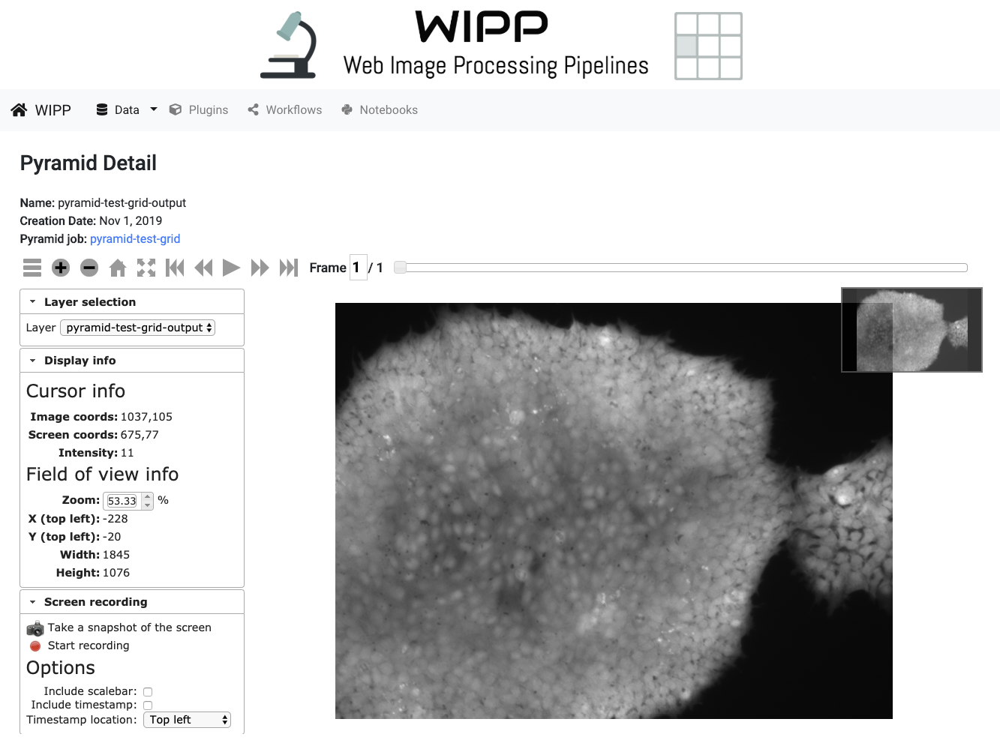

# Pyramids

Using the [WIPP Pyramid Building plugin](https://github.com/usnistgov/WIPP-pyramid-plugin), users can generate pyramidal representations of their images and explore them in the Pyramid Deep Zoom view. Click on "Data" on the menu bar, then "Pyramids" to access the list of Pyramids. 

*Figure1: WIPP Pyramids list screenshot*

This view displays the list of available Pyramids, which can be sorted by name and creation date and size. The sorting is achieved by clicking on the arrows next to the column headings. 
The edit box below the heading "Name"" is designed for entering text to filter the list of items shown below. Click on the name of a pyramid to access the pyramid deep zoom view.

# Pyramid detail information

The information about the pyramid includes name, creation date and the source pyramid building job. Below the pyramid information is the deep zoom view of the pyramid.

*Figure 2: WIPP Pyramid detail screenshot*

For an in-depth user manual of the deep zoom view of pyramids, see [this webpage](https://isg.nist.gov/deepzoomweb/help#image-view-web-deep-zoom-toolkit) (please note that some of deep zoom tools are not available in WIPP, such as colony searching and features).

# Change Pyramid visibility to Public

A Pyramid visibility can be changed to "Public" by clicking on the user group icon on the right. 
Public visibility means that the pyramid can be seen by all connected and anonymous users, and can be used by other connected users in workflows. It cannot be modified or deleted by other users, except for admin users.
Once a pyramid is Public, its visibility can not be changed back to Private.